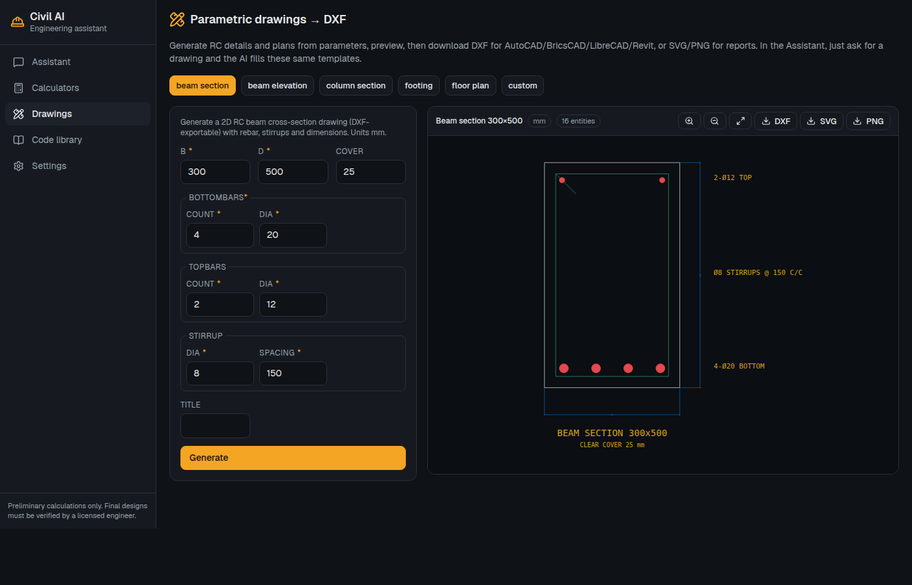
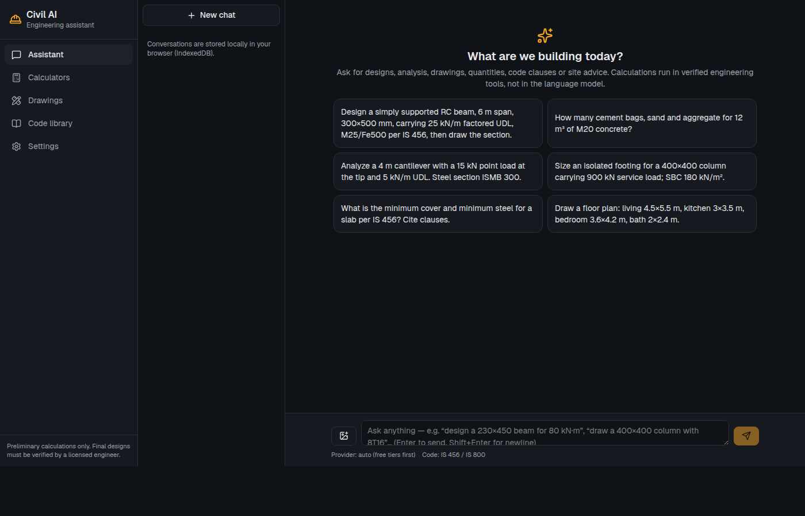
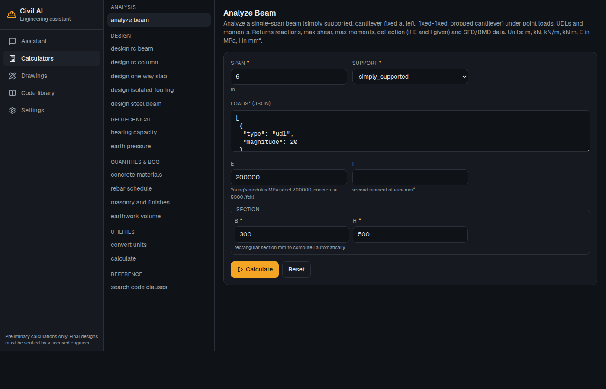
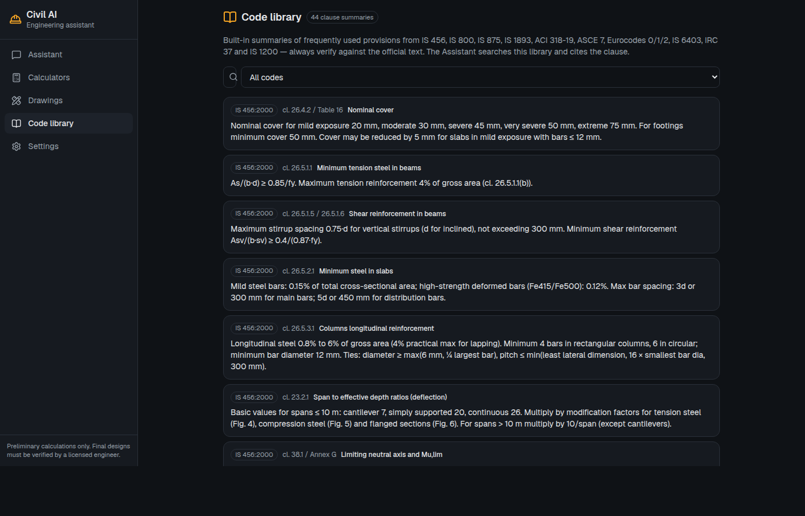
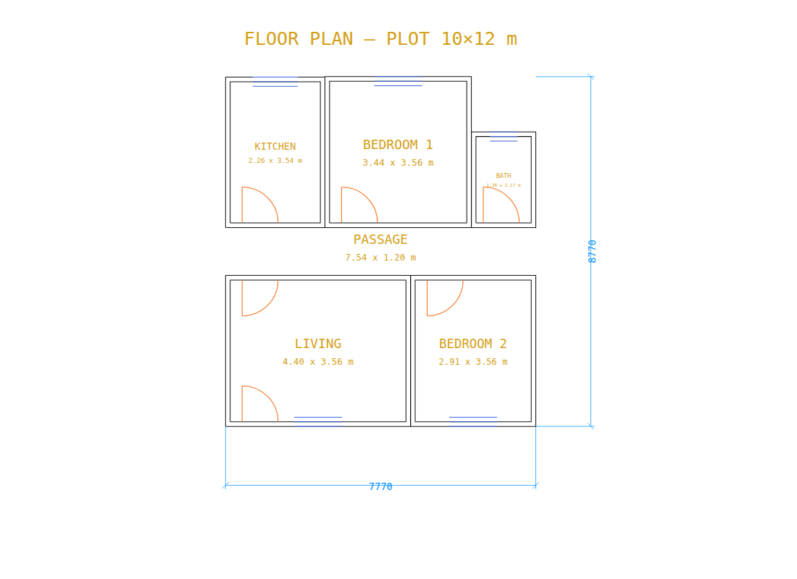
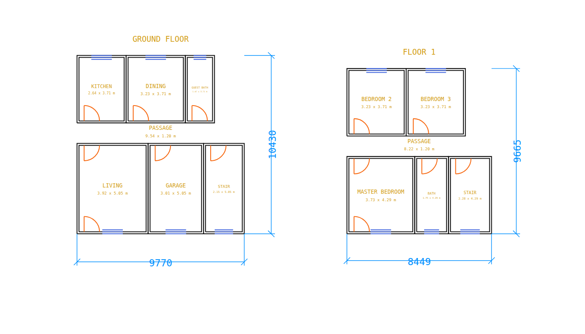

# Civil AI — AI assistant for civil & construction engineers

Design · analysis · drawings (DXF) · quantities · code references — with a chat assistant that **runs every calculation in deterministic engineering tools** (never in the language model) and cites code clauses.

Runs as a web app (Vercel-ready) **and** as a Windows/Linux/macOS desktop app (Electron, works offline with Ollama). Uses free-tier AI APIs by default with automatic fallback when a quota is hit.



| Assistant | Calculators | Code library | Auto floor plan | Building planner (2 storeys) |
|---|---|---|---|---|
|  |  |  |  |  |

## Features

| Area | What you get |
|---|---|
| **Built-in offline model** | One click in Settings downloads a 16–30 MB llama.cpp engine plus a Qwen 3.5 model sized to the PC (0.5–2.7 GB; never larger than 4B by default). No key, no quota, no data leaves the machine. GPU acceleration via Vulkan (NVIDIA/AMD/Intel) or Metal, with automatic CPU fallback |
| **Assistant** | Streaming chat; picks provider automatically (Gemini → Groq → OpenRouter → Cerebras → Mistral → Cloudflare → Ollama → Claude/OpenAI/DeepSeek); image upload for site photos/drawings; LaTeX formulas; local conversation history (IndexedDB, no account needed) |
| **Analysis** | Beam analysis (SS / cantilever / fixed / propped) with SFD, BMD and deflection charts |
| **RC design** | Beams (flexure + shear), short columns, one-way slabs, isolated footings — IS 456:2000 and ACI 318-19, with step-by-step working and pass/fail checks |
| **Steel** | ISMB / W-shape selection per IS 800 / AISC with deflection check |
| **Geotech** | Terzaghi bearing capacity (water-table correction), Rankine earth pressure |
| **Quantities** | Concrete materials (cement bags/sand/aggregate), bar bending schedule, brick masonry, plaster, paint, tiles, excavation, earthwork (end-area, prismoidal, grid cut/fill) |
| **Architecture** | Building planner: plot (rectangular / square / irregular polygon), road direction, setbacks, building type (single family, duplex, apartments, shop-house, commercial, office), storeys, bedrooms/baths, garage, shops, windows per room → one floor plan per storey (DXF), NBC minimum-size checks, footprint, coverage and FAR. Plus room-list space planning and plot statistics |
| **Drawings** | Parametric RC beam section/elevation, column section, footing plan+section, floor plans, free-form details → **DXF (R12, opens in AutoCAD/BricsCAD/LibreCAD/Revit)**, SVG, PNG |
| **Code library** | 60+ clause summaries — India (IS 456/800/875/1893, NBC 2016), Bangladesh (BNBC 2020, RAJUK rules), China (GB 50010/50009/50011/50007, GB 55001), USA (ACI 318-19, ASCE 7), Europe (EN 1990/1991/1992) — searchable and cited by the assistant. Summaries only: always verify against the official text |
| **Utilities** | Unit converter, exact expression calculator |
| **Subscriptions (SaaS mode, default)** | Accounts with email verification, password reset and 2FA; superadmin/admin/support/user roles; plans (Free, Pro ৳300, Max ৳1000) with daily quotas, per-plan models and offline-model entitlement; encrypted server-held API keys; payments by manual bKash / Nagad / Rocket / Bangla QR / bank (admin approval) **or** online via bKash merchant API, aamarPay, shurjoPay, SSLCommerz, Stripe (instant activation, auto-renewal webhooks); renewal reminders and grace period; help page with FAQ and support tickets; admin panel (users, payments, tickets, keys, gateways, plans, site, usage); audit log, CSRF and security headers. Desktop app links to the service for cloud models and unlocks the local model on paid plans. See docs/08 |
| **Model choice** | Switch provider/model any time from the selector under the chat box or in Settings; benchmark any model with `npm run eval` (see docs/07) |

## Quick start (web)

```bash
cd civil-ai
npm install
cp .env.example .env.local   # optional: add server-side keys
npm run dev                  # http://localhost:3000
```

The app opens in **subscription mode**: sign up (the first account becomes admin), then in **/admin → Provider API keys** paste a free **Gemini** key (https://aistudio.google.com/apikey) and/or **Groq** key (https://console.groq.com/keys). Users then sign up and chat within their plan; they never see keys. For a personal instance without accounts run `CIVIL_AI_MODE=byok npm run dev` and paste keys in Settings instead.

Run the tests:

```bash
npm test
```

## Desktop app (Electron)

```bash
npm run build                # builds the standalone Next server
cd desktop && npm install
npm run dist:linux           # or dist:win / dist:mac → desktop/release/
```

For development: `npm run dev` in the web app, then `cd desktop && npm run dev` (opens the dev server in an Electron window).

Offline use: Settings → Local AI → Install. The app picks the model for the hardware (see table below), downloads it once into `~/.civil-ai` (or the Electron user-data folder) and starts a local OpenAI-compatible server on port 8765. Choose **Local first** as provider to prefer it, or leave **auto** to use free cloud tiers first and the local model as unlimited fallback. Ollama is also supported if you already have it.

| Machine | Model installed by default | Download | RAM in use | Typical CPU speed |
|---|---|---|---|---|
| Discrete GPU with ≥ 12 GB VRAM and ≥ 16 GB RAM | Qwen 3.5 9B Q4 | 5.7 GB | ~7 GB | 30+ tok/s on GPU |
| ≥ 8 GB RAM (most laptops, no GPU or 4–8 GB GPU) | Qwen 3.5 4B Q4 | 2.7 GB | ~3.5 GB | 8–15 tok/s (much faster with any GPU) |
| 5–8 GB RAM | Qwen 3.5 2B Q4 | 1.3 GB | ~2 GB | 15–25 tok/s |
| < 5 GB RAM | Qwen 3.5 0.8B Q4 | 0.5 GB | ~1 GB | 30+ tok/s |
| Advanced, opt-in only (Settings → "Show advanced models") | Qwen 3.5 9B / 35B-A3B | 5.7 / 22 GB | 7 / 24 GB | slow without a strong GPU |

The app detects RAM, CPU and GPU (name and VRAM on Windows, Linux and macOS) and picks the tier automatically; ordinary PCs without a strong GPU never get more than the 4B model, so the app stays responsive. Tiny models are fine for calculators and unit conversions; for full design conversations the 4B model or a free cloud model gives better results.

## Deploying

See [docs/04-deployment.md](docs/04-deployment.md) — Vercel Hobby for testing (free, non-commercial), Vercel Pro / Cloudflare for commercial use, Supabase/Neon when you add accounts and sync, domain for ~$10/yr.

## Documentation

- [01 – Market research: existing civil-engineering AI products](docs/01-market-research.md)
- [02 – Free/low-cost APIs, hosting, packaging (verified Sept 2026)](docs/02-api-and-hosting-research.md)
- [03 – Architecture](docs/03-architecture.md)
- [04 – Deployment & costs](docs/04-deployment.md)
- [05 – Roadmap](docs/05-roadmap.md)
- [06 – Setup guide: keys, hosting, desktop first-run](docs/06-setup-guide.md)
- [07 – Model evaluation on civil tasks](docs/07-model-evaluation.md)
- [08 – Selling subscriptions: SaaS mode, admin panel, free-tier hosting](docs/08-saas-and-free-hosting.md)

## Verification status (17 Sept 2026)

- `npm test`: 44 engineering/robustness unit tests pass (beam theory closed forms, IS 456 τc, Terzaghi factors, quantities, DXF/SVG, steel cantilever deflection, tool-input normalization, hardware-based model selection).
- `npm run lint`, `npx tsc --noEmit`, `npm run build`: clean. Desktop bundle prepared (`desktop/app`).
- **Civil benchmark (`npm run eval`, 12 tasks incl. a house-plan brief, real models on this machine):**
  - Built-in offline model Qwen 3.5 4B (llama.cpp, CPU-only, i9-14900K): **11/11 correct**, ~50 s per task.
  - Ollama Qwen 3.5 9B: **11/11 correct**, ~15 s per task.
  - Full design conversation (analysis → RC design → drawings) verified end to end on both; results match hand calculations (Mu = 112.5 kN·m, Ast ≈ 619 mm²).
- Cloud providers (Gemini, Groq, Claude, Qwen, GLM…) are wired through the same path and verified with a mock OpenAI-compatible server; run `npm run eval -- --provider gemini --keys keys.json` once you have keys to record their scores.
- Not verified on this machine: launching the Electron window (no display available). The desktop shell code starts the bundled server, opens the window and auto-installs the local model; test it on a machine with a desktop.

## Disclaimer

Civil AI produces preliminary calculations and sketches. All outputs must be verified and approved by a licensed professional engineer against the applicable local codes before use in construction.
